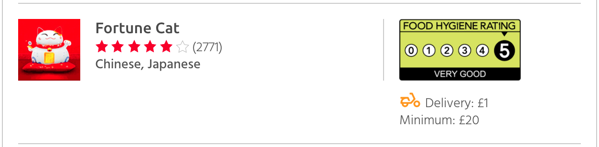

# JUST EAT Scores on the Doors

This is a Google Chrome Plugin for displaying Scores on the Doors on JUST EAT.

Clicking on the rating image gets you to the *Food Standards Agency* record for that restaurant.

* Uses *Food Hygiene Rating Scheme Application Programming Interface* ([FHRS API](http://api.ratings.food.gov.uk/Help)) to fetch the rating for each restaurant on JUST EAT based on the business postcode and name.
* Uses [fuzzyset.js](https://github.com/Glench/fuzzyset.js) to analyse the similarities in restaurant names in case of mismatching.

Please note that this plugin is *not perfect* and sometimes there might be some inaccuracies, if the data do not agree on both sides. That might mean, a business has changed location or name, but hasn't updated the records yet. Also, some restaurants might use a slightly different name on JUST EAT to potentially attract customers, which could lead to mismatches. 

## Use it

* Clone or download the code
* Under *Extensions* click *Load unpacked extension* and select the folder

## How it looks

